<h3>Swift • SwiftUI</h3>

I build and iterate on <b>iOS products</b> with a focus on <b>Experience, Detail, and Feel.</b>
 
I spend a lot of time exploring <b>interactions, animations, and tools</b>
 
Figuring out what actually feels right.

 

  

  
  

  

<!--   
 -->

  

